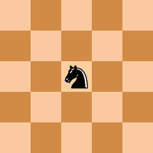
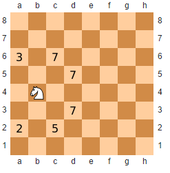
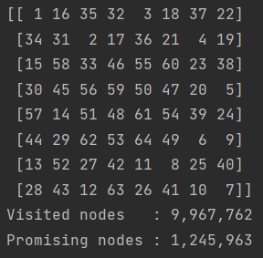

# The Knight’s Tour Problem – Backtracking Recursive Solutions

# Introduction

The knight’s tour puzzle is played on a chess board with a single chess piece, the knight. 

A knight is placed on any square of an empty board and, moving according to the rules of chess, must visit each square exactly once, like so:

 

The Knight’s Tour is actually a mathematical (Hamiltonian Path) problem dating back centuries.  Many solutions have 
been proposed, ranging from brute force algorithms to neural networks.

# Validate Legal Position

**Each sqaure has 8 potential directions for the knight to go.
But not all squares have 8 valid options because sometimes some of the steps will move the knight beyond board's boundries.

The knight will start from an empty square and then just try each option out of the 8 potential future move.

  # Warnsdorff’s Algorithm - Heuristic Solution
  
  The heuristic solution proposed in 1823 by the German mathematician H.C. Warnsdorff that states the following simple rule: 
#### Always move the knight to an adjacent, unvisited square with minimal degree.
  
 
As you can see its the same algorithm as the brute force soltuion with one change - The knight doesn't randomly choose a direction and a step to go, but it chooses the next move based on which square has the feweset onward moves.
  
Starting from any square, the knight must move to an unvisited square that has the fewest successive moves.  
Choosing a square with the fewest successors avoids a possible dead-end when traversing the board.  However, 
because Warnsdorff’s rule is heuristic, it is not guaranteed to find a solution.

# Output

