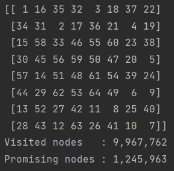

# The Knight’s Tour Problem – Backtracking Recursive Solutions

# Introduction

The knight’s tour puzzle is played on a chess board with a single chess piece, the knight. 

A knight is placed on any square of an empty board and, moving according to the rules of chess, must visit each square exactly once, like so:

 

The Knight’s Tour is actually a mathematical (Hamiltonian Path) problem dating back centuries.  Many solutions have 
been proposed, ranging from brute force algorithms to neural networks.

# Data Structure

Since every square on the board can be either visited or not, and there are 64 squares (for a standard chess board 8X8), we can use a **Bit Array**.

We will treat the chess board as 64 bits, which will be either 0 or 1 to indicate if the knight has visitied a certain sqaure on the board.
- '0' its the initial state of all the bits which means that no square has been visitied yet by the knight.
- '1' means the the square has been visited by the knight and **cannot be visited again in the same tour**.

# Validate Legal Position

**Each sqaure has 8 potential directions for the knight to go.
But not all squares have 8 valid options because sometimes some of the steps will move the knight beyond board's boundries 
i.e if we are looking at the chess board as a bit array, so index 0 is the first square on the board (top left corner) and index 63 is the last square on the board (bottom right corner). In this case - index 65 is out of boundries as well as -1 in fact every index that is not in the range of 0-63.**

and in this way, its easier to check if the next move brings the knight to an illegal position (out of boundries for example if the row or column number is not in the range of 0-7(or as many rows and columns there are).

The knight will start from an empty square and then just try each option out of the 8 potential future move.

  # Warnsdorff’s Algorithm - Heuristic Solution
  
  The heuristic solution proposed in 1823 by the German mathematician H.C. Warnsdorff that states the following simple rule: 
#### Always move the knight to an adjacent, unvisited square with minimal degree.
  
 
As you can see its the same algorithm as the brute force soltuion with one change - The knight doesn't randomly choose a direction and a step to go, but it chooses the next move based on which square has the feweset onward moves.
  
Starting from any square, the knight must move to an unvisited square that has the fewest successive moves.  
Choosing a square with the fewest successors avoids a possible dead-end when traversing the board.  However, 
because Warnsdorff’s rule is heuristic, it is not guaranteed to find a solution.

# Output

 
 

  
  
  

